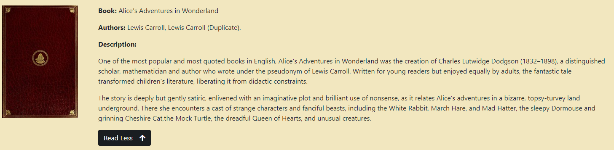
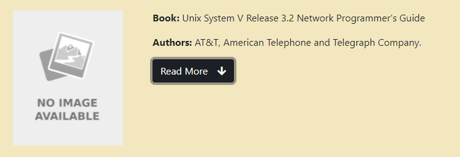
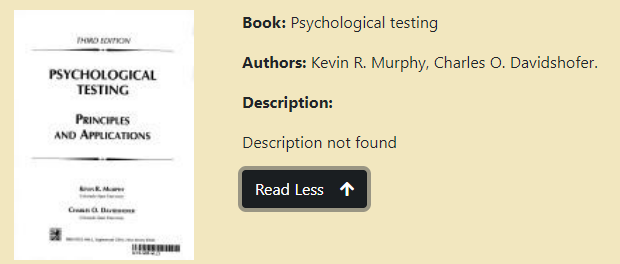
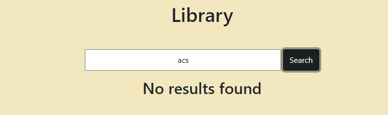

# LIBRARY APP

## ABOUT THE PROJECT

The application aims to promote the reading of books through the external Open Library service.

(<a href="#top">back to top</a>)

## DESCRIPTION

The application should consist of a simple textbox to allow the user to search for all books in a specific category.

(<a href="#top">back to top</a>)

## HOW TO USE THE APPLICATION

Once the user clicks on the "search" button, the application must contact the API of the external service Open Library. Once the application has retrieved the list of books, it will only have to display the cover of the book, title and the list of authors.

Once the list of books has been obtained through the search, when the user clicks on the "Read More" button, the application must be able to display the description of the book. 

(<a href="#top">back to top</a>)

## POSSIBLE VISUALISATIONS

The data obtained from the Open Librery API may sometimes be missing. Depending on the missing data, the display may be different.

### FULL VISUALISATIONS

The image below shows the typical display with all data in full:

### IMAGE NOT AVAILABLE

If the API does not find the book cover as a result, then the cover will be displayed as follows:

### DESCRIPTION NOT AVAILABLE

If the API does not find the book description as a result, then the cover will be displayed as follows:

### SEARCH WITHOUT RESULTS

If the search returns no results, then the following image will be displayed: 

(<a href="#top">back to top</a>)

## JS LIBRARY

### AXIOS

Axios is a Javascript library used to make HTTP requests from XMLHttpRequests from the browser and it supports the Promise API. It can be used intercept HTTP requests and responses and enables client-side protection against XSRF.

### REMARKABLE

Remarkable is a Javascript library used to convert Markdown text to HTML.

**Reason for use:** Sometimes the book descriptions requested from the Open Library API were not normal text but markdown text. Through the use of this library the descriptions will be displayed correctly.

### WEBPACK

Webpack is a static module bundler for JavaScript applications: it takes all the code from applications and makes it usable in a web browser. Modules are reusable blocks of code created from JavaScript, node_modules, images and CSS styles from apps that are packaged for easy use in a website.

### LOADASH

Lodash is a JavaScript library that helps programmers write more concise and maintainable JavaScript. It can be broken down into several main areas: Utilities - for simplifying common programming tasks such as determining type as well as simplifying math operations.

(<a href="#top">back to top</a>)

## TEST THE APPLICATION

Want to try the application? You can try the app on [Netlify](https://infallible-hawking-9f4257.netlify.app)

(<a href="#top">back to top</a>)

## CONTACTS

Email: [gennuso.biagio@gmail.com](mailto:gennuso.biagio@gmail.com)

Github: [Library App](https://github.com/bilabixxx/LibraryApp)

(<a href="#top">back to top</a>)

